 
### 点击小图标可跳转至模板下载页面  /  Click on the thumbnail to access the plugin  
当前共有 [19] 个模板 / Here are [19] plugins now    
## Apple  

<a href="https://cdn.jsdelivr.net/gh/lihaoyun6/capXDR-plugins/plugins/rMBP16-K(Gary).zip">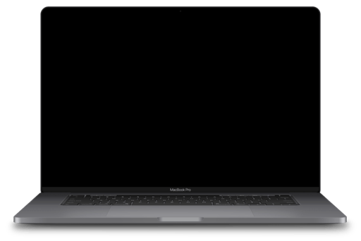</a>
<a href="https://cdn.jsdelivr.net/gh/lihaoyun6/capXDR-plugins/plugins/rMBP16-K.zip">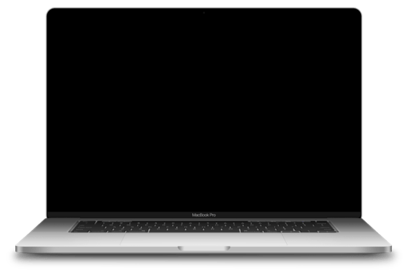</a>
<a href="https://cdn.jsdelivr.net/gh/lihaoyun6/capXDR-plugins/plugins/rMBP16(Gray).zip">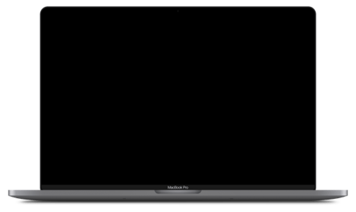</a>
<a href="https://cdn.jsdelivr.net/gh/lihaoyun6/capXDR-plugins/plugins/rMBP16.zip">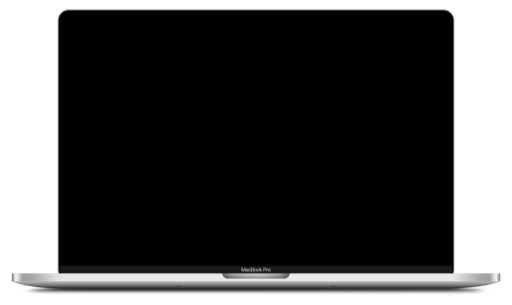</a>

<a href="https://cdn.jsdelivr.net/gh/lihaoyun6/capXDR-plugins/plugins/rMBA13-K(Gold).zip">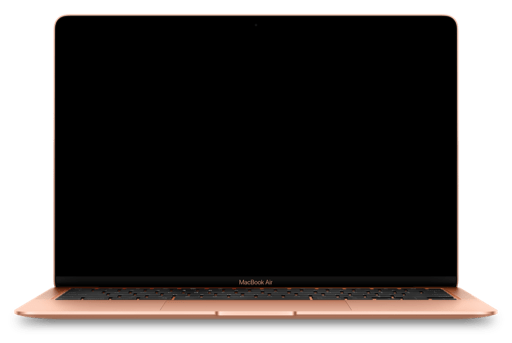</a>
<a href="https://cdn.jsdelivr.net/gh/lihaoyun6/capXDR-plugins/plugins/rMBA13-K(Gray).zip">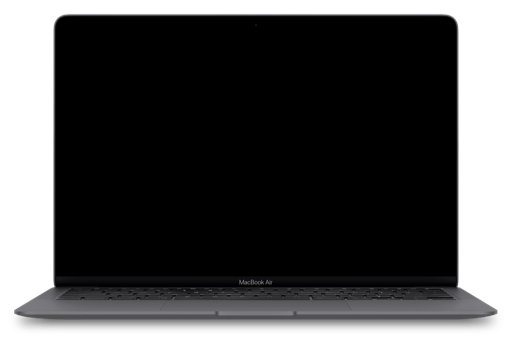</a>
<a href="https://cdn.jsdelivr.net/gh/lihaoyun6/capXDR-plugins/plugins/rMBA13-K.zip">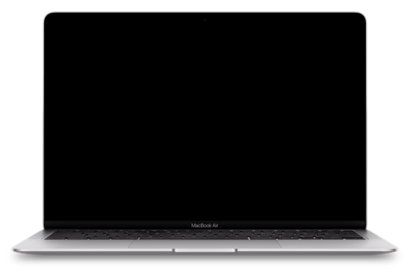</a>
<a href="https://cdn.jsdelivr.net/gh/lihaoyun6/capXDR-plugins/plugins/rMBA13(Gold).zip">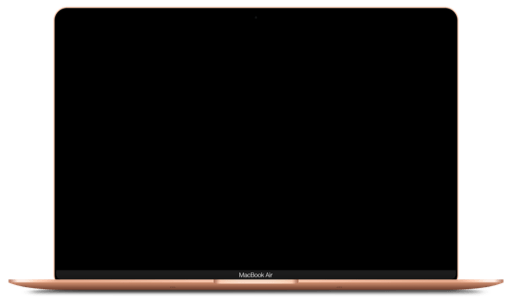</a>
<a href="https://cdn.jsdelivr.net/gh/lihaoyun6/capXDR-plugins/plugins/rMBA13(Gray).zip">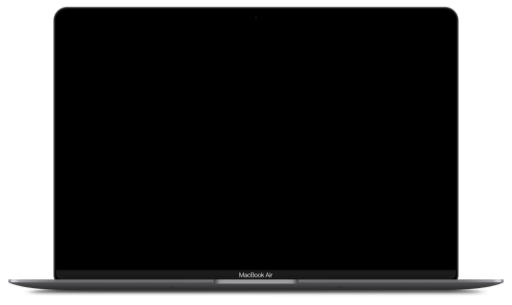</a>
<a href="https://cdn.jsdelivr.net/gh/lihaoyun6/capXDR-plugins/plugins/rMBA13.zip">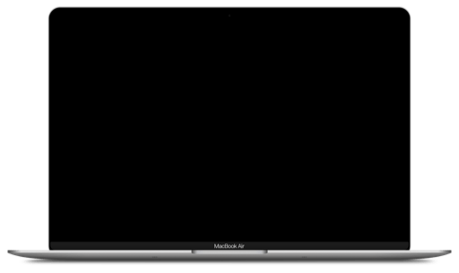</a>
<a href="https://cdn.jsdelivr.net/gh/lihaoyun6/capXDR-plugins/plugins/MBA13.zip">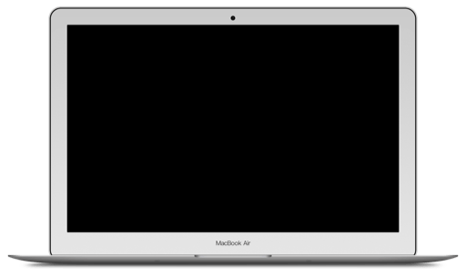</a>

## Dell

<a href="https://cdn.jsdelivr.net/gh/lihaoyun6/capXDR-plugins/plugins/Dell-P2715Q.zip">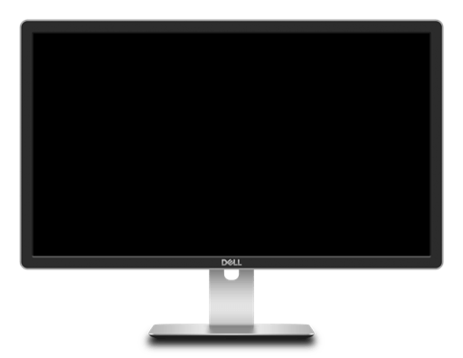</a>
<a href="https://cdn.jsdelivr.net/gh/lihaoyun6/capXDR-plugins/plugins/XPS15.zip">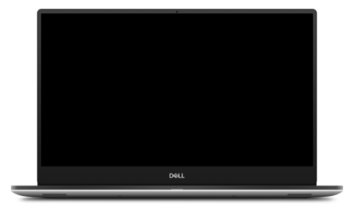</a>

## LG

## Lenovo

<a href="https://cdn.jsdelivr.net/gh/lihaoyun6/capXDR-plugins/plugins/Lenovo-Air14IML(Gold).zip">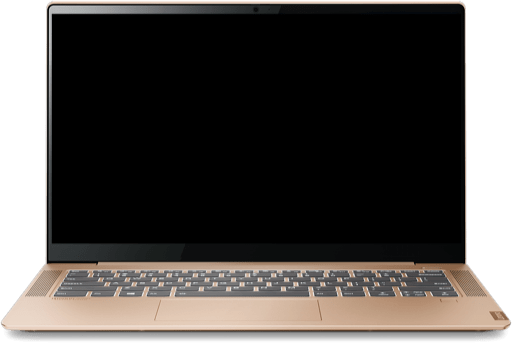</a>
<a href="https://cdn.jsdelivr.net/gh/lihaoyun6/capXDR-plugins/plugins/Lenovo-Pro13IML.zip">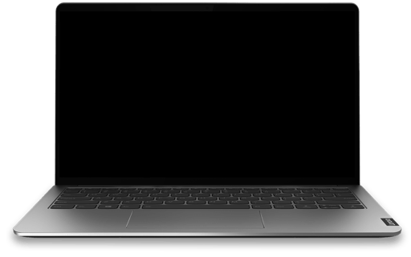</a>

## Other
<a href="https://cdn.jsdelivr.net/gh/lihaoyun6/capXDR-plugins/plugins/Asus-TUF6.zip">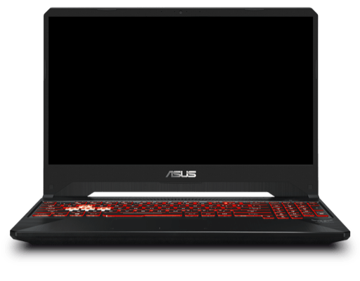</a>
<a href="https://cdn.jsdelivr.net/gh/lihaoyun6/capXDR-plugins/plugins/OMEN-4P.zip">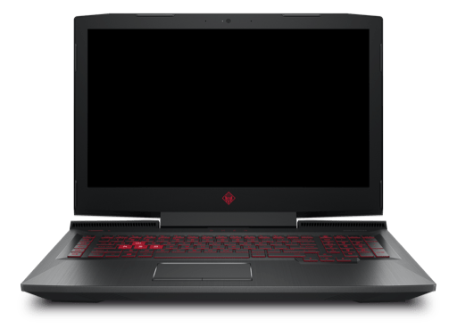</a>
